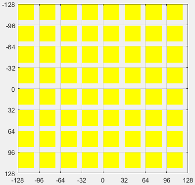

# worldgen-simulate

> 2019.11.24

## 生物群系

Minecraft的生物群系采用一种类似图像金字塔的方式来实现。

金字塔中的每张图片表示了一个区域（Area），它描述了生物群系在生成时的一个中间状态。区域经过从金字塔底端到顶端的下采样（Down Sample），以及从金字塔顶端到底端的上采样（Up Sample）之后，就完成了其内的生物群系生成。

下采样和上采样分工明确。其中，下采样负责对区域的位置和大小进行调整，上采样负责对区域进行填充。我们把区域的一次下采样和一次上采样称为一个层（Layer）。

根据其采样操作的不同，层被分为许多类型，有些会生成新的生物群系，有些则对现有群系进行随机放大。层与层之间以一对一或一对多的关系相互连接，构成了下图所示的生物群系生成链。

出于性能考虑，在一些不需要使群系精确到方块的场合下将不会使用完整的生成链，例如计算[密度图](#密度图)时需要预生成当前位置的群系以应用特定群系的地势。此时，生成链开头的VoronoiZoom层会被省略。

从RiverMix层开始，生成链分裂为两条子链，一条负责生成基本生物群系，另一条负责生成河流。第一条子链在Hills层又分裂出一条支链，用于生成突变群系。最终，生成链末端的Island层将会执行3次，因此实际的金字塔应该是长这个样子的。

前面说过，从金字塔顶端开始的上采样会对区域进行填充，这个填充的过程也是生物群系生成的过程。Island层作为第一个执行上采样的层，它具体做了什么呢？

Island层的任务非常简单，那就是随机生成0-1矩阵。如果你熟悉生物群系id的话，可能意识到0代表海洋而1代表平原。实际上，数值在这个阶段还没有被赋予生物群系的含义，0和1只是区分了海洋和陆地而已。

到了AddSnow层，温度信息被引入，陆地部分分化为DESERT、WARM、COOL、ICY四种温度类型，分别对应数值1~4，0则保持海洋的含义不变。

陆地生物群系在Biome层才根据其温度类型被正式生成，而海洋随着蘑菇岛（AddMushroomIsland层）和深海（DeepOcean层）的加入也逐渐拥有了其原本的含义。

说完了基本群系，我们回过头来看看在整个生成链中最核心也是数量最多的Zoom层。

顾名思义，Zoom层用于随机放大，巨型生物群系就是通过在生成链中插入两个额外的Zoom层来实现的。

随机放大的原理也很简单，我们把区域按像素切分，然后在空隙处填入：
1. 若空隙位于左右像素之间，随机取左右两个像素之一。
2. 若空隙位于上下像素之间，随机取上下两个像素之一。
3. 若空隙位于四角像素之间，取四角像素的众数，若有多个众数则随机取其一。

程序中，随机放大是借助一个2\*2的核（Kernel）实现的，核在区域内“扫描”，使得每轮遍历都能同时访问4个像素。核的思想也体现在别的层中，比如AddIsland层（叉形）和RemoveTooMuchOcean层（十字形）。

经过若干个Zoom层的处理之后，原图将具有分形的特点，十分好看。

Zoom层还有个进阶版本就是生成链开头的VoronoiZoom层。与Zoom的放大2倍不同，VoronoiZoom给区域放大4倍。

Voronoi这个词往往使人联想到像下图这样的细胞状图案，它叫做Worley噪声（又叫维诺图或泰森多边形）。我们将看到VoronoiZoom层的随机放大算法确实是基于Worley噪声的。

因为是4倍放大，相邻像素被切分后将让出3个像素的空隙。接下来，每个被切分的像素（后称结点）各自向周围随机偏移一小段距离，偏移范围在横纵方向上都是-1.8~1.8。最后，空隙中每个像素取距离它最近的结点对应的像素作为自己的值。

对空隙中每个像素，计算区域内所有结点到该像素的距离是极其愚蠢的。实际上，我们只需要保证结点的偏移范围不超过2，就能在每个像素只判断周围4个结点的前提下生成正确的Voronoi图。而上述的偏移范围1.8满足这个要求。

### 我们需要更深入一些

你可能注意到[生成链示意图](#chain)中每个层附近的数字，这是每个层的随机源。随机源经过一个二次函数的若干次迭代后，将得到这个层的基种子（Base Seed）。

仅使用基种子是不够的。为使生物群系依赖世界种子，需要将基种子和世界种子迭代融合，得到的结果称为层种子（World Gen Seed）；为使同一世界相同位置拥有相同的群系，又将层种子和一对坐标迭代融合，得到了核种子（Chunk Seed）。

在实际生成过程中，随机数通过截取核种子的高5字节并模上随机范围产生，每次产生一个随机数都将更新核种子，从而产生随机序列。

这套由随机源引导的随机数生成机制远不仅仅是为了在相同种子的世界中生成相同的群系。它还有两个重要的作用，一是保证相邻区块的生物群系衔接，二是使河流有概率恰好生成在群系的分界线上。

### 生物群系衔接

你可能已经听说过Perlin噪声算法，我们只需要对每个格点根据其坐标生成一个随机向量，就能使得相邻的晶格共享一对随机向量，从而使噪声值连续。那么对于生物群系而言，相邻的区块共享了什么信息呢？

这次我们从下采样入手，初始区域（也就是一个区块）经过VoronoiZoom层的处理之后，位置由`ChunkX*16,ChunkZ*16`变为了`ChunkX*4-1,ChunkZ*4-1`，长和宽由16变为6。横向对比相邻区域不难发现，相邻区域的位置相差了4个单位，而长宽可是有6个单位啊，这说明相邻区域在经过VoronoiZoom层的下采样之后产生了部分重叠。

这些重叠部分在遍历的过程中自然拥有相同的核种子，因此尽管它们属于不同的区域，生成的随机数仍然是一样的。

随着一系列下采样的进行，区域间的重叠部分越来越多，乃至出现跨区域重叠，那么到了金字塔顶端的Island层，一个区块将会与相隔多远的区块发生区域重叠呢？答案是约2304个区块！纵向对比之下，金字塔顶层区域的每个像素都相当于一个约256\*256个区块组成的开阔地，这下你该明白相邻区块共享了多么庞大的信息量了吧。(笑)

总而言之，相邻区块在最开始并没有共享任何信息，但是越接近顶层共享的信息越多，差异也越小。核种子使区域的重叠部分成为桥梁，只要保证一个区域内的群系是自然而连续的，就能保证相邻区块的群系也是自然而连续的。

### 河流与突变群系

为了搞清楚河流的生成原理，我们首先需要研究RiverInit层，这个层同样适用于突变群系。

RiverInit层将非海洋部分（包括深海和蘑菇岛）重置为2~300000的随机数，此时这些部分表现为白噪声。

最关键的一步来了，我们发现从RiverInit层到RiverMix层之间共有6个Zoom层，在生成链的另一侧，从Biome层到RiverMix层之间也有6个Zoom层，并且这两列Zoom层所使用的随机源完全相同，从下往上依次为[1000,1001,1000,1001,1002,1003]。这意味着从Biome层和RiverInit层返回的区域在放大时将增加完全相同的细节，而这些细节很大程度上体现为群系分界线的形状。

RiverInit层生成的白噪声，在经过了6次放大后将形成随机的块状区域。由于2~300000这个区间实在过大，可以近似地认为相邻的块之间不会出现相同的值，因此这些块拥有最小的“粒度”。另一方面，Biome层生成的群系的种类终究十分有限，因此在放大后应当有不少的群系是包含了多个RiverInit层生成的块的。此时如果对RiverInit块进行边缘检测并在边缘处设置河流，那么所有由Biome层生成的群系边界都会出现河流，并且大面积群系内部也会出现河流。

现在我们就来看看River层是怎么做的。River层将RiverInit块分为奇偶两部分，使这些块状区域大量地合并，然后执行边缘检测。因此由Biome层生成的群系边界以及大面积群系内部将有一半的概率会出现河流，这就解释了河流为什么能够生成在群系边界。

陆地群系与蘑菇岛可以理解，为何深海也需要进行RiverInit呢？这是因为深海存在山脉变种：平原和森林，这些山脉变种会在Hills层生成，此时河流就有了存在的意义。

除了生成山脉变种，Hills层还负责群系突变，突变群系id由原群系id加上128得到。与河流类似，RiverInit层提供了用于分块的白噪声，它与Biome层提供的基本群系在经过两个具有相同随机源的Zoom层的放大之后发生合并，其中1/29的块用于生成突变群系，另1/29的块用于生成山脉突变群系（若发生突变的山脉变种没有对应的山脉突变群系，该山脉变种会被还原）。同时，根据上述结论，突变群系不会被两个由Biome层生成的群系一分为二，因此类似下图这种情况是不会也是不应该出现的。

下面用一张图来概括整个生物群系生成过程。

## 密度图

众所周知，Minecraft使用Perlin噪声来产生地形起伏，更准确地说，是3维的Perlin噪声。噪声值描述了一个位置的密度，当密度大于0时生成石头，小于0时生成空气。将高度引入噪声函数，使密度随着高度的增加有减小的趋势，就能使石头聚集在世界下方，空气聚集在世界上方。

在密度图生成过程中，区块被分割为一个个4\*8\*4的区元，噪声计算在区元的8个顶点上进行，区元内的密度则使用三线性插值得到。这种做法使得一个区块只需要计算5\*33\*5的噪声图，大大减少了计算量。

另一方面，地表的起伏受生物群系影响，这是通过将群系的基础高度（Root Height）和高度变化率（Height Variation）引入噪声函数实现的，因此一个区块还需要获取5\*5的群系图。由于区元的水平尺寸是4\*4，一个略去VoronoiZoom层的生成链恰好符合我们的需求。我们简单地传入与噪声图一致的位置参数`ChunkX*4,ChunkZ*4`以及长宽5，就能得到这个群系图。

然而事情并没有这么简单，尽管三线性插值已经保证了一定程度上的地形过渡，但是群系交界处的高度过渡仍然不够平滑。你也不想看到在短短4格内就从海平面上升至云层的迫真高原地形吧。

为了在相邻群系间添加平滑过渡，我们不直接使用当前群系的基础高度和高度变化率，而是计算周围5\*5范围内群系的基础高度和高度变化率的加权平均，权重如下图所示。

这样一来，一个区块所需的群系图就由5\*5扩展到了9\*9（至于代码中为什么是10\*10本垃圾暂且蒙在鼓里），位置则变为了`ChunkX*4-2,ChunkZ*4-2`。你可能还记得完整生成链中经过VoronoiZoom层下采样之后的位置参数是`ChunkX*4-1,ChunkZ*4-1`，二者差异并不大，因此不会出现地表高度与实际群系不符的情况。

下面让我们来看看程序具体是怎么计算密度图的。首先，一个区块实际上会生成4张噪声图：
* 高度噪声（Depth Noise）：叠加16次的二维Perlin噪声，大小为5\*5，噪声范围[-8.191875,8.191875]。
* 主噪声（Main Noise）：叠加8次的三维Perlin噪声，大小为5\*33\*5，噪声范围[-13.25,13.25]。
* 最小噪声（Min Noise）：叠加16次的三维Perlin噪声，大小为5\*33\*5，噪声范围[-127.998046875,127.998046875]。
* 最大噪声（Max Noise）：叠加16次的三维Perlin噪声，大小为5\*33\*5，噪声范围[-127.998046875,127.998046875]。

第一张高度噪声经过一个分段函数的处理，直接叠加在群系的加权平均高度上，随后联合区元顶点的y值与群系的加权平均高度变化率，计算出区元顶点的基础密度。如果是放大化世界，群系的基础高度与高度变化率将成倍增加。

$$
baseDensity = \frac{avgRootHeight * 2.125 + PieceWise(depthNoise) * 4.25 + 7.96875 - unitY}{avgHeightVariation * 0.9 + 0.1}
$$

这个分段函数将高度噪声的范围由[-8.191875,8.191875]映射到[-1/14,1/40]，对于基础高度值为0的群系，其实际高度——也就是密度从大于0变为小于0的分界点，大约在61.32~64.6之间，这正是海平面附近的高度。

很好，由于高度噪声的引入，我们的地形已经有了上下起伏，但如果仅此而已的话，我们压根就不需要什么3维密度噪声，而且高度变化率这个变量目前没有起到任何作用。

我们之所以使用3维噪声，是因为3维噪声不是“单值”的，它能够生成F形的悬崖，并且稍加改动就能生成像下界这样的洞穴世界，这是2维噪声无论如何也做不到的。

为此，我们将最小噪声与最大噪声根据主噪声进行插值，然后附加到基础密度上，得到最终密度。

$$
density = minNoise + (maxNoise - minNoise) * Clamp(mainNoise, 0, 1) + baseDensity
$$

那么，引入3维噪声之后，群系的高度变化率起作用了吗？且慢，我们以区元顶点高度为横轴，密度为纵轴绘图，可以得到一个一次函数图像（实线部分），它显示了不同高度下的基础密度。

由于引入了3维噪声，最终密度将会围绕基础密度上下波动，波动的范围是固定的，也就是最小和最大噪声的范围，图中用两条虚线表示出最终密度的上下限。可以看出，基础高度越高，实线与横轴的交点，即石头与空气的分界点越高；而高度变化率越大，实线越平缓，虚线在横轴上划出的区域也越大，地势也就越陡峭。

## 地表和基岩

现在，区块内已经生成了基本的方块（空气、石头、水）和生物群系，下一步是根据方块与上表面的距离设置地皮和填充层，并在世界底部生成基岩。默认情况下，地皮为草方块，填充层为泥土。

顶层方块和填充层方块取决于生物群系，但也有例外，比如沙砾会作为所有低海拔地区的顶层方块。在沙漠中，沙石不是沙漠群系的填充层方块，而是使用额外的逻辑生成的。

基岩在世界0~4的高度生成，越往上越稀疏，是纯粹的白噪声。

填充层的厚度显然不是固定的，它受一个单独的噪声影响：
* 填充层噪声（Stone Noise）：叠加4次的二维Simplex噪声，大小16\*16，噪声范围[-8.25,8.25]。

Simplex噪声其实就是Perlin噪声的三角晶格变体，不过它与Perlin噪声略有不同：
1. 为了获取某个位置所在三角格点的坐标，需要将该位置逆变换到方形格点内，求出方形格点坐标后，再将该格点坐标变换回三角格点。
2. 因为只有3个格点，Simplex噪声自然不能像Perlin噪声那样对点积结果进行插值。相对地，Simplex噪声使用衰减曲线`max(r^2-d^2,0)^4`计算各点积的加权和，r一般取三角形的高。
3. 当Perlin噪声的4个梯度向量指向各自的对角顶点时，噪声值在正方形中心取到最大值1，反之为-1，因此Perlin噪声不需要归一化；而Simplex噪声不同，它的最大值在三角形一边的中点上取到，各梯度向量指向该点且模长均为根号2，此时该点的噪声值为：

$$
(0.5 - \frac{1}{6}) ^ 4 * \frac{1}{\sqrt{6}} * \sqrt{2} * 2 \approx \frac{1}{70}
$$

因此Simplex噪声需要归一化，方法是给加权和乘上70。

填充层噪声与一个微弱的白噪声叠加，最终转化为0~5的整数，作为填充层的厚度。

$$
Floor(stoneNoise / 3 + 3 + Rand(0, 0.25))
$$

当厚度为0时，地皮也将一并剥去，出现裸露的岩石。

若去除地皮后地表低于海平面，则会以水或冰填充（取决于群系温度）。

除了控制填充层的厚度，这个噪声还用于生成一些随机的地表花纹，比如高山群系的石头或沙砾，巨型针叶林的砂土和灰化土等。

此外，沼泽和平顶山群系还会生成专门的噪声图。

### 沼泽

对于沼泽群系，大量的水和睡莲使用另一个Simplex噪声生成：
* 沼泽噪声：叠加1次，固定种子2345。

沼泽会将该噪声值大于0且位于海平面的顶层方块设置为水，并为其中噪声值小于0.12的水的上方生成睡莲。

### 平顶山

平顶山类型的群系拥有特殊的方块生成逻辑，在中等海拔以上会生成条带装的硬化粘土层，对于每个世界，这个粘土带的颜色分布是固定的。

程序中，粘土带是一个长度为64的数组，它使用下面的步骤生成：
1. 将数组的所有元素初始化为未染色的硬化粘土。
2. 以1~5的随机间隔生成橙色硬化粘土。
3. 尝试2~5次，每次选取随机位置向后生成1~3个黄色硬化粘土。
4. 尝试2~5次，每次选取随机位置向后生成2~4个连续的棕色硬化粘土。
5. 尝试2~5次，每次选取随机位置向后生成1~3个连续的红色硬化粘土。
6. 尝试3~5次，以4~19的随机间隔生成白色硬化粘土，有概率向前或向后生成淡灰色硬化粘土。

在世界中，这个粘土带的高度偏移量还会受到一个Simplex噪声影响：
* 粘土带噪声：叠加1次，采用世界种子。

好了，下面是Mojang的神秘代码环节。传入这个噪声的坐标是`x/512,x/512`，因此只有在x方向上才会产生高度偏移。这还没完，Mojang还把区块内方块的x和z偏移搞反了，两个因素共同作用下导致平顶山内部会形成下图这样的方形的锯齿。

开头提到的填充层噪声也会对平顶山的地表产生影响。例如，平顶山顶部会形成由未染色的硬化粘土组成的花纹，若海拔较高且群系为森林变种（Mesa Plateau F），顶层花纹将由砂土和草方块代替。

在海平面附近，海平面以上的部分会在地表生成红沙，海平面以下的部分则生成橙色硬化粘土，橙色硬化粘土也会固定生成在红沙下方。

平顶山的布莱斯（Bryce）变种会生成高耸的尖峰，它由两个Simplex噪声控制：
* 石柱噪声：叠加4次，固定种子0。
* 石柱顶部噪声：叠加1次，固定种子0。

石柱噪声大于0时生成尖峰，决定尖峰的高度，石柱顶部噪声决定尖峰的高度上限。

## 洞穴和峡谷

Minecraft的洞穴是使用随机游走的方式对地层进行“雕刻”而形成的。为方便解释，我们把随机游走的起点称为洞穴起点。

我们知道，世界以区块为单位生成，而洞穴往往会延伸到多个区块，因此每个区块生成洞穴时都会遍历周围的17\*17个区块来计算周围所有的洞穴起点对当前区块的影响。由此也可知，一个完整的洞穴最多会跨越17\*17个区块。

相信你已经对随机数控制不陌生了，为了使洞穴在区块间衔接，我们对每个区块计算种子，以确保不同的区块遍历到同一个洞穴起点时生成相同的洞穴。

上述生成洞穴的方式同样适用于后面的峡谷和结构生成。

程序中，每个区块内有1/7的概率生成0~14个洞穴起点（对数分布），洞穴起点的高度范围是7~126（也是对数分布）。

洞穴由两部分组成：房间和通道。每个洞穴起点除了向外生成通道外，有1/4的概率会生成一个房间，此时通道的数量也会增加0~3个，形成分支。每个通道拥有随机的初始方向和基础半径（为使通道更加平缓，初始方向的俯仰角度接近0）。相比于通道，房间的基础半径较大，且实际高度为宽度的一半。

洞穴的长度取决于通道的挖掘次数，游戏中这个次数在85~112之间。从洞穴起点开始，挖掘位置每次朝当前方向移动一个单位，并以一个较小的方向偏移值更新当前方向，挖掘半径则在基础半径上波动。每次更新挖掘位置时，有3/4的概率尝试进行一次挖掘，若挖掘位置距离当前区块过远或者检测到了水，当次挖掘取消。

若通道的基础半径大于1，将会在洞穴长度1/4~3/4的随机位置进行分叉，形成与当前方向垂直的两个新的通道，新的通道初始半径减小并且不会再次分叉。

为使洞穴地面更加平坦，每次挖掘的区域是一个截去一部分底部的球（对于房间是椭球）。可以挖去的方块包括了石头、当前群系的填充层方块和顶层方块。挖去的部分一般以空气填充，若y坐标小于等于10则替换为岩浆。

若洞穴穿过了顶层方块导致填充层方块暴露在地表，该填充层方块会被替换为顶层方块。在挖掘时，蘑菇岛、沙滩和沙漠的填充层和顶层方块被视为泥土和草方块，因此这些群系的地表不会出现洞穴入口。

峡谷生成算法与洞穴十分相似，每个区块有1/50的概率生成峡谷起点，其初始半径为洞穴的两倍，实际高度为宽度的3倍。

峡谷侧壁的层状凸起和凹陷通过一个长度为256的随机数组实现，这个数组的每个元素有1/3的概率初始化为1~4的随机数，剩余2/3的概率则继承上一个元素的值。

随机数组的值决定了峡谷在某个高度的狭窄程度。峡谷的单次挖掘区域是一个截去顶部和底部的椭球，椭球的高约为宽的3\*sqrt(6)倍，随机数组的值越大，椭球的宽度越小，在这个高度下挖掘的宽度也越小。

## 结构构建

主世界的结构有废弃矿井、村庄、要塞和小型结构几种，小型结构又包括了沙漠神殿、丛林神庙和女巫小屋。每个结构由一个起点（Start）和多个组件（Component）构成，小型结构较为特殊，它只有一个组件。

确定结构起点后，结构将开始递归创建组件，并在达到一定规模之后停止，我们把这个过程称为结构构建。每个组件拥有特定的碰撞盒，因此构建时能进行相交检测。

因为结构的构建逻辑较为复杂，它并没有像洞穴那样对同一个起点为周围所有区块执行一次构建，而是在第一次构建之后记录这个结构的起点和所有组件的信息，保存在存档的`data/<结构名称>.dat`中。结构的正式生成则是在后面的[点缀](#点缀)阶段进行的。

为了防止两个结构相交，结构起点拥有特殊的限制。

* 对于废弃矿井，每个区块有0.004的基础概率生成起点。在世界中心±80个区块的范围内，距离中心越近概率越低。

* 对于村庄，每32\*32个区块中24\*24的部分尝试生成一个起点（因此两个村庄的最小距离为8个区块），要求群系为平原、沙漠或热带草原。

* 对于下届堡垒，每16\*16个区块有1/3概率在中心8\*8的部分尝试生成一个起点。

* 对于要塞，距离世界中心40~72个区块构成的环形区域内生成3个，每个夹角120度，要求所在群系不为海洋、河流、沼泽等地势较低的群系。

* 对于小型结构，区块坐标限制与村庄相同，但只在沙漠、丛林或沼泽生成。

## 点缀

点缀阶段将依次生成这些特征：结构、水湖、岩浆湖、地牢、群系装饰、生物、冰雪。

除了上面介绍的结构，其余特征的大小不会超出一个区块，但是位置在一个区块内随机，因此实际可能跨越两个区块。

Minecraft给每个区块存储了一个TerrainPopulated标签，标记这个区块是否已经完成了点缀。当区块加载时，该区块将尝试通知自身、自身西侧区块、自身北侧区块、自身西北侧区块进行点缀，而每个区块点缀前则会判断自身东侧、南侧、东南侧的区块是否已经加载。只有当这3个区块全部加载时，当前区块才会进行点缀，以保证特征不会因为跨区块而被截断。

世界中随处可见的草、树木、矿石等等，大多属于群系装饰。由于特征种类繁多，这里不展开细讲，有兴趣可以借助本人提供的[FeatureHelper](https://github.com/Hydrop002/FeatureHelper)模组进行研究。
